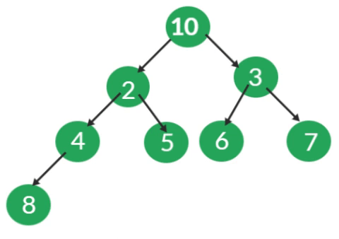

# WORD RECOMMENDER

## O PROBLEMA

Neste trabalho, o objetivo é criar um sistema que possibilite a funcionalidade de autocompletar
e oferecer sugestões de palavras aos usuários. Para atingir essa finalidade, adotaremos a
estrutura da árvore binária como base.

Para esclarecer as resoluções diante do problema dado, sera discorrido as discussões neste arquivo com base nestas perguntas:

*Como fazer a leitura do arquivo de entrada de maneira que se consiga extrair todas as palavras e contar sua frequencia?
*De que maneira, e com qual estrutura é possível extrair da estrutura de armazenamento do texto de entrada as 20 palavras mais frequentes?
*Como vai ser introduzido as informações das 20 palavras mais recorrentes nas árvores binaria simples, avl e na árvore do código de huffman?
*Como vão ser processados os textos de entrada para cada palavra que o usuário escrever no arquivo de entrada como palavra a ser procurada nos textos?
*Se a palavra de entrada não estiver no texto o que vai ser feito?

## FASES DE ESPECIFICAÇÃO, PROJETO E IMPLEMENTAÇÃO

Primeiramente para começar a extrair os dados dos vários arquivos de entrada foi utilizado um contador para contar dentro do loop onde esta ocorrendo o caminhamento letra a letra do arquivo de entrada para que fosse possível concatenar as palavras e formar o nome de cada arquivo, a lógica é converter o inteiro em string e concatenar com o resto do nome que será padrão para a qualquer arquivo que entre no dataset como arquivo de entrada,o padrão de nomeação destes arquivos são: txt01, txt02, e assim sucessivamente, observe que foram definidos apenas dois textos de entrada, para adicionar mais textos a serem processados basta alterar no arquivo Analysis o desvio condicional onde se chama o métod getText dentro do loop while(*ch).

<pre>
if(counter < 3){
        mp.mp.clear();
        ch = getText(loc,counter);
}
</pre>

Era necessário extrair os dados e coloca-los na memória para serem processados e adicionados a estrutura de dados conhecida como tabela de dispersão ou Hash. Para tal requisito foi utilizado o modo de leitura das linguagens utilizadas neste projeto(C e C++) com a biblioteca fstream e como modo de leitura foi utilizado a função wifstream no modo binário, tal função requer apenas o endereço do arquivo a ser lido e o modo de leitura. assim foi adicionado a uma variavela qual foi denominada de buffer neste projeto, e posteriormente seu valor foi retornado a outra que se encontrava no trecho do código onde ocorreu a análise dos dados do arquivo, cujo nome é Analysis, tal função é chamada na função principal da aplicação, que é o marco de inicio de todos os procedimento para cumprir com o objetivo principal do projeto o de fazer um analisador de recorrência de palavras em um texto.

Tendo os dados a dispozição para processamento na memoria foi necessário decidir qual estrutura de dados utilizar para armazenar os dados, e alem disso como identificar onde o buffer se encontrava a medida que fosse percorrido letra a letra do arquivo de entrada. Para armazenar as palavras do arquivo de entrada foi utilizado a tabela de dispersão hash, pois a mesma usa como indereçamento uma chave o que facilita a pesquisa, cujo custo computacional é O(1), assim a medida que ocorreu a repetição das palavras no texto foi facil localizar tal palavra na estrutura de dados e contar sua frequencia o qual se faz o principal objetivo.

Imagine se fosse usado em vez da hash uma lista para armazenar as palavras, todas as vezes que uma palavra fosse ser inserida a lista teria de ser percorrida novamente para averiguar se essa palavra já não foi inserida. O que não ocorre na estrutura hash, como a pesquisa tem custo O(1).

Para realizar o armazenamento de um dado a biblioteca unordered_map recebe um valor e o converte em um inteiro que se torna chave para aquela string ou o tipo que for passado para ser armazenado e envia a uma função que realiza operações para gerar uma chave única do tamanho de 32 ou 128 bits, essa função hash se chama MurmurHash, foi criada por Austin Appleby em 2008, ela inicialmente pega valores aleatórios e atribui a algumas variaveis do tipo inteiro, então a função entra em um loop que pega partes de 4 bytes, ou seja, se a chave representar algo maior que 32 bits ele vai repartir essa chave e trabalhar com partes de 32 bits por vez, essa parte retirada da chave vai ser utilizada a cada interação para realizar duas operações de multiplicação e uma operação lógica entre os bits do valor, que nesse caso é a operação de ROL, que se trata de uma operação bit a bit que desloca os bits de um valor para a esquerda e "roda" o bit mais significativo (o bit mais à esquerda) para a posição menos significativa (o bit mais à direita). Basicamente, é como mover os bits para a esquerda e fazer com que o bit que "cai" pela esquerda apareça novamente na direita. 

O pseudocódigo a seguir mostra a função:

<pre>
algorithm Murmur3_32 is
    // Note: In this version, all arithmetic is performed with unsigned 32-bit integers.
    //       In the case of overflow, the result is reduced modulo 232.
    input: key, len, seed

    c1 ← 0xcc9e2d51
    c2 ← 0x1b873593
    r1 ← 15
    r2 ← 13
    m ← 5
    n ← 0xe6546b64

    hash ← seed

    for each fourByteChunk of key do
        k ← fourByteChunk

        k ← k × c1
        k ← k ROL r1
        k ← k × c2

        hash ← hash XOR k
        hash ← hash ROL r2
        hash ← (hash × m) + n

    with any remainingBytesInKey do
        remainingBytes ← SwapToLittleEndian(remainingBytesInKey)
        // Note: Endian swapping is only necessary on big-endian machines.
        //       The purpose is to place the meaningful digits towards the low end of the value,
        //       so that these digits have the greatest potential to affect the low range digits
        //       in the subsequent multiplication.  Consider that locating the meaningful digits
        //       in the high range would produce a greater effect upon the high digits of the
        //       multiplication, and notably, that such high digits are likely to be discarded
        //       by the modulo arithmetic under overflow.  We don't want that.

        remainingBytes ← remainingBytes × c1
        remainingBytes ← remainingBytes ROL r1
        remainingBytes ← remainingBytes × c2

        hash ← hash XOR remainingBytes

    hash ← hash XOR len

    hash ← hash XOR (hash >> 16)
    hash ← hash × 0x85ebca6b
    hash ← hash XOR (hash >> 13)
    hash ← hash × 0xc2b2ae35
    hash ← hash XOR (hash >> 16)
</pre>

No que se refere ao tratamento de colisões o unordered_map faz o seguinte: Se uma chave equivalente a k já existir no contêiner, atribui std:: forward < M > ( obj ) ao mapped_type correspondente à tecla k. Se a chave não existir, insere o novo valor como se fosse por insert, construindo-o a partirvalue_type ( k, std:: forward < M > ( obj ) ).

Quanto ao tamanho do hash quando criado a estrutura se tem acesso diretamente a essa informação apartir da versão do C++11, este tamanho depende das politicas da biblioteca utilizada, no caso do unordered_map esse tamanho é de apenas um compartimento ou bucket, que pode ser comprovado através desse algoritmo:

<pre>
#include< iostream >
#include< unordered_map >

int main() {
    std::unordered_map<int, std::string> myMap;

    // Get the number of the buckets
    size_t numBuckets = myMap.bucket_count();

    std::cout << "Number of buckets: " << numBuckets << std::endl;

    return 0;
}
</pre>

Para realizar a identificação de onde o buffer se encontrava foi utilizado as seguintes considerações:

* Este programa deverá ler uma coleção de arquivos contento textos sem nenhuma formatação ("arquivo ASCII") onde cada sentença termina por um sinal de pontuação (".",
"?", "!"").
* Cada parágrafo é separado por, pelo menos, uma linha em branco.
* Considere como palavra uma sequência de letras delimitada por espaço em branco, ”coluna da esquerda”, ”coluna da direita” e símbolos de pontuação.

Assim quando foi identificado que a variavel com os dados do texto de entrada estava em alguma destas situações a palavra já estava em uma outra variável que foi sendo concatenada letra a letra a cada vez que o loop de leitura foi ocorrendo. A motivação do uso da linguagem C++ neste projeto também se faz mais significativa neste momomento da discução visto que a concatenação de uma string na mesma é mais simples que na linguagem C.

A cada vez que isso ocorria foi sendo adicionado a palavra a estrutura e assim foi até o fim do texto, após o término do processamento do texto por completo a tabela de dispersão continha as k palavras mais recorrentes, nesse caso k = 20, se desejar conhecer um número distinto de palvras mais recorrentes basta alterar porem com isso surge outro entrave, como saber em meio a milhares de palavras quais são as mais recorrentes?, a resposta é: basta usar uma árvore de prioridade heap de tamanho k, fazendo um heap min e percorrendo a hash buscando os valores mais recorrentes, a medida que se percorre a tabela de dispersão do primeiro elemento ao último se compara com o primeiro elemento, que após ter executado o heap min teremos o menor valor no nó raiz. Assim encontrar o elemento que deve sair da árvore foi simples.

O Heap funciona da seguinte forma: inicialmente se reparte o vetor em duas partes e com isso se pega o indice do elemento que esta no meio do vetor, se usa esse elemento para iniciar o procedimento de realização do hepfy, assim elemento por elemento do meio do vetor ao primeiro se analisa as casas que são resultado das expressões 2 * posição atual sendo analisada = filho a esquerda, e 2 * posição atual sendo analisada + 1 = filho direito, se acaso os filhos forem menores que o nó pai se faz a troca, e ao fim da análise tem se na primeira posição ou raiz da árvore o menor elemento.

Foram utilizadas três árvores diferentes: a árvore binária simples, cujo método de inserção envolve comparações de valores, posicionando os maiores valores na sub-árvore direita e os menores valores na sub-árvore esquerda. A árvore AVL, por sua vez, segue um método de inserção semelhante à binária simples, mas com a adição de considerar a distância entre um nó e suas sub-árvores direita e esquerda. Se essa diferença for igual a +2 ou -2, ocorre uma rotação de elementos, que nada mais é do que uma troca de posições dos elementos na árvore. Por último, temos a árvore de Huffman, que combina as frequências mais baixas de palavras. Como resultado, temos uma árvore com os maiores valores em sua sub-árvore direita e os menores valores em sua sub-árvore esquerda.

#### BINÁRIA SIMPLES

A árvore binária, entre as três, é a implementação mais simples e fácil de compreender em termos de sua lógica de manipulação para inserção de dados. Na linha 118, é chamada uma função que faz parte do arquivo responsável pela árvore binária, cujo nome é 'Tree'. Esses dois arquivos, um de cabeçalho (header) e um de código-fonte, contêm todas as funções necessárias.
Uma das funções é a 'FillingBinaryTree', que percorre todos os elementos da estrutura 'Heap', que contém as 20 palavras mais frequentes do texto em análise no momento da chamada da função. Nessa função, as chaves (strings) e os valores (frequência das palavras) são inseridos um por um. Em paralelo, é chamada a função 'insertItem', que cria novos nós e insere as informações de acordo com a frequência, posicionando-as à esquerda do nó atual se o valor for menor e à direita se for maior. Quando se move para a esquerda ou direita e encontra um nó nulo, um novo nó é criado e as informações são inseridas.
Quanto à impressão, tanto na AVL quanto na árvore binária simples, foi utilizado o método de impressão central. Esse método consiste em percorrer a árvore de forma a caminhar para a esquerda até não ser possível mais, e depois começar a desempilhar as funções chamadas. Cada componente da pilha contém um comando de impressão, o que resulta na impressão correspondente ao nó. Em seguida, ocorre um deslocamento para a direita, que só ocorre se o filho não for nulo.

#### AVL

Este tipo de representação de dados possue uma caracteristica importante para fins de pesquisa, inserção e remoção de dados em uma árvore, o mesmo se trata do balanceamento o qual garante que a altura da árvore seja log(n) assim o número de comparações para inserir, buscar e remover vai ser minimamente log(n + 1), para a mesma se manter balanceada é necessário realizar notações de acordo com o calculo de distancia do nó folha ao respectivo nó de análise, sendo nós a esquerda representado valores negativos e os nós a direita representando valores positivos, se a subtração dos niveis abaixo do nó corrente resultarem em +2 ou -2 será feito deslocamento dos nós para esquerda se for -2 ou para direita se for +2.As rotações duplas vão acontecer quando os sinais dos calculos dos pesos de um nó pai e um nó filho do mesmo forem distintos.

#### HUFFMAN

A codificação de Huffman veio para resolver um problema de representação de valores como bits de maneira eficiente, qualquer sistema de representação que possua a propriedade de qualquer sequencia de bits não corresponda a mais de uma sequência de letras é considerado um código de prefixo que é o caso do código de huffman, e sendo assim é possível o representar como uma árvore binária, que é o que é feito neste trabalho, o que é feito é passar todos os elementos da Heap para a árvore do código de Huffman, e após ser passados os elementos para a estrutura se inicia construção da árvore, o que ocorre é o seguinte, primeiramento se ordena o conjunto de dados de maneira crescente, pois assim é possível ter nas duas primeiras posições as menores frequencias e assim se cria um novo nó da mesma tipagem cujo filhos esquerdo e direito são os estes dois primeiros nós assim você vai sobrescrevendo um nó e elimnando o outro até que sobre apenas o nó raiz na estrutura, concretizando a árvore binária, completa,pois ela tem nós em todos os seus niveis, mas não é totalmente cheia de nós em todos os niveis.O mesmo é muito utilizado para compressão de dados.

Ao fim dos procedimentos aqui descritos se somava um contador que era passado como parametro para uma função a qual concatenava com o padrão de nome de todos os arquivos, ja mencionado neste presente relatório e com isso o próximo arquivo é armazenado na Hash, inserido as 20 palavras mais frequentes no Heap e inserido tambem nas árvores binária, Avl e na árvore do código de Huffman, porem enquanto se lê o arquivo de entrada e armazena as palavras no hash, tambem foi sendo feito uma verificação se a palavra estava no texto ou não, se a mesma não estiver não será estruturado o Heap, a árvore binária e as demais, pois não seria lógico diante da proposta de recomendação textual, pois se a palavra esta no texto e mostrando se as palavras mais frequentes do mesmo a tendencia de se recomendar o texto é grande, enquanto em que em um texto onde aquela palavra não esta não é lógico recomenda-lo ao usuário, já que não se adequa a sua necessidade.

## MÁQUINA DE TESTE

<table style="width: 100%;" border="1">
        <tr align="center" >
            <td colspan="2">
                

                         
                        
Notebook 550XDA Sansung

                                 
                

            </td>
        <tr>
        <tr align="center">
            <td>
               

                     
                    
RAM

                     
               
 
            </td>
            <td >
                 
                    
8Gb DDR4

                 
            </td>
        </tr>
        <tr align="center">
            <td style="width: 20%;">
                

                     
                    
SO

                     
                

            </td>
            <td >
                 
                    
Linux Ubuntu v22.04, 64bits

                 
            </td>
        </tr>
        <tr align="center">
            <td style="width: 20%;">
                 
                    
    
                        CPU
                    

                 
            </td>
            <td >
                 
                    
Intel core i5 11° geração 2,40GHz

                 
            </td>
        </tr>
    </table>

## CONCLUSÃO

Pode-se concluir que uma maneira muito eficiente de extrai palavras salvando sua frequencia é usando uma hash, pois imagine se fosse necessário contar a frequência em uma lista linear por exemplo seria necessário percorrer os n elementos incesseridos no pior caso para encontrar o elemento,e ainda neste projeto, desenvolvemos um sistema de autocompletar e sugestões de palavras que utiliza uma abordagem baseada em árvores binárias, codificação de Huffman e árvores AVL para oferecer aos usuários uma experiência aprimorada ao procurar palavras em um conjunto de textos fornecidos. Ao longo do processo, realizamos várias etapas cruciais, cada uma contribuindo para a eficácia e a eficiência do sistema.Foi feita a coleta de dados a partir de um arquivo de entrada, que serviu como base para as pesquisas e sugestões de palavras. Em seguida, implementamos uma árvore binária padrão, que nos permitiu identificar palavras relevantes e próximas às pesquisas dos usuários. A frequência das palavras e sua proximidade com os termos de pesquisa foram consideradas na determinação da relevância.

A segunda etapa envolveu a codificação de Huffman, uma técnica que otimiza a estrutura da árvore binária. Isso resultou em códigos para cada palavra e uma reorganização da árvore com base nesses códigos. Avaliamos a eficácia dessa abordagem em relação à árvore binária padrão, buscando melhorias no desempenho e na funcionalidade.

Por fim, implementamos uma árvore AVL, que é uma estrutura de dados balanceada, e repetimos o processo de análise. Comparamos o tempo médio de processamento da construção da estrutura e a geração de saída com as abordagens anteriores. Essa comparação nos permitiu avaliar a eficácia da árvore AVL em relação às outras implementações.

Ao concluir este projeto, obtivemos uma compreensão mais profunda das diferentes abordagens das árvores binárias e sua influência no sistema de autocompletar e sugestões de palavras. Ficou claro que a escolha da estrutura de dados tem um impacto significativo no desempenho do sistema. A codificação de Huffman mostrou-se uma técnica promissora para otimização, enquanto a árvore AVL demonstrou sua eficácia em manter um desempenho consistente.

Além disso, o sistema resultante fornece aos usuários uma maneira eficaz de encontrar palavras relevantes e sugestões úteis em um conjunto de textos, o que pode ser aplicado em várias situações práticas. A análise comparativa realizada neste trabalho destaca a importância de escolher a estrutura de dados correta para resolver problemas específicos.

Em resumo, este projeto nos permitiu explorar e entender as vantagens e desvantagens de diferentes abordagens de árvores binárias na criação de um sistema de autocompletar e sugestões de palavras. Com base em nossa análise, podemos concluir que a escolha da estrutura de dados é fundamental para o sucesso de um sistema desse tipo, e as técnicas de otimização, como a codificação de Huffman, podem desempenhar um papel significativo na melhoria do desempenho.

## REFERÊNCIAS

HAROLD.Thomas.Algoritmos Teoria e prática.3ed.Elsevier Editora Ltda.Rio de Janeiro – RJ – Brasil.2012.pag 134 a 148.
ROSEN.Kenneth.Matematica Discreta e Suas aplicações.AMGH Editora Ltda.São Paulo - SP - Brasil.2010.pag 695 a 707.

## AUTOR

Frank Leite Lemos Costa. Aluno de Engenharia da Computação no <a href = "https://www.cefetmg.br/">CEFET</a>, 4° período.

## CONTATO

e-mail: frankcefet090@gmail.com

